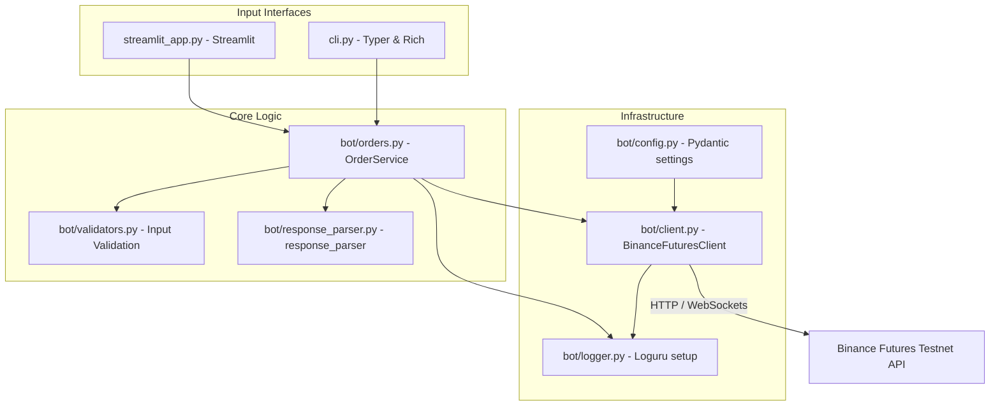

# PrimeTrade Trading Bot (Binance Futures Testnet)

PrimeTrade is a modular, high-reliability Python trading application engineered to execute trades on the **Binance Futures Testnet (USDT-M)**. Designed with clean architecture principles, it offers developer-friendly CLI interfaces, real-time logging telemetry, a local dashboard companion, and high-performance validation checks.

---

## Architecture Overview

PrimeTrade separates concerns by dividing components into input interfaces, orchestration layers, pre-flight validators, client drivers, and data normalization adapters.



- **Validation Layer (`bot/validators.py`)**: Fails fast by checking symbols, sides, order types, prices, and quantities locally before any network calls, saving latency and unnecessary API hits.
- **Client Integration (`bot/client.py`)**: Wraps python-binance with exponential backoff retries using `tenacity` for temporary network dropouts, while shielding endpoints from business logic failures.
- **Response Parser (`bot/response_parser.py`)**: Maps API-specific camelCase string variables to standardized snake_case floats using Pydantic models.
- **Logger (`bot/logger.py`)**: Implements rotating logging (10 MB files, 7-day retention) storing request payloads, responses, latency, and full exception tracebacks.

---

## Folder Structure

```
/Users/apple/Desktop/PrimeTrade_pythonProject/
├── bot/
│   ├── __init__.py          # Bot package init exposing clean symbols
│   ├── config.py            # Environment-based Pydantic configuration settings
│   ├── client.py            # Binance Futures API Client wrapper
│   ├── orders.py            # Coordinates validation, client, and parsing
│   ├── validators.py        # Validates order constraints and symbols
│   ├── exceptions.py        # Custom exceptions for granular error classification
│   ├── logger.py            # Loguru setup with rotating files
│   ├── models.py            # Pydantic schemas for order inputs and outputs
│   ├── response_parser.py   # Maps API responses to models
│   └── helpers.py           # Precision rounding and timestamp formatters
├── logs/
│   └── trading.log          # Rotated local logs
├── examples/
│   ├── market_order.log     # Example logged execution of MARKET order
│   └── limit_order.log      # Example logged execution of LIMIT order
├── tests/
│   ├── test_validators.py   # Unit tests for parameter checking
│   └── test_parser.py       # Unit tests for raw API schema parsing
├── cli.py                   # Main CLI Entrypoint (Typer & Rich)
├── streamlit_app.py         # Companion UI Dashboard (Streamlit)
├── Dockerfile               # Production multi-stage Docker build file
├── docker-compose.yml       # Orchestrates CLI and Dashboard containers
├── railway.json             # Railway App deployment configuration
├── portfolio_assets.md      # Resume bullets and interview guides
├── CONTRIBUTING.md          # Contribution guidelines
├── .env.example             # Configuration template
├── .gitignore               # Ignored files configuration
├── requirements.txt         # Package dependencies
├── LICENSE                  # MIT License
└── README.md                # This documentation
```

---

## Setup & Installation

### Local Machine Deployment
Ensure you have Python 3.12 or 3.13 installed.

1. **Activate Virtual Environment**:
   ```bash
   python3 -m venv venv
   source venv/bin/activate  # On Linux/macOS
   # or venv\Scripts\activate on Windows
   ```

2. **Install Dependencies**:
   ```bash
   pip install -r requirements.txt
   ```

3. **Configure Environment Variables**:
   Copy `.env.example` to `.env` and fill in your keys:
   ```bash
   cp .env.example .env
   ```
   Modify the fields inside `.env`:
   ```env
   BINANCE_API_KEY=your_actual_testnet_api_key
   BINANCE_SECRET_KEY=your_actual_testnet_secret_key
   BINANCE_BASE_URL=https://testnet.binancefuture.com
   BINANCE_USE_TESTNET=True
   LOG_LEVEL=INFO
   ```

---

## Run Commands

### 1. Run Interactive CLI
Execute with no arguments to launch the interactive menu:
```bash
python cli.py
```

### 2. Run Direct CLI Arguments
Place orders instantly using command flags:

#### Place MARKET Order
```bash
python cli.py --symbol BTCUSDT --side BUY --type MARKET --quantity 0.01
```

#### Place LIMIT Order
```bash
python cli.py --symbol BTCUSDT --side SELL --type LIMIT --quantity 0.01 --price 102000
```

#### Place STOP_LIMIT Order
```bash
python cli.py --symbol BTCUSDT --side BUY --type STOP_LIMIT --quantity 0.01 --price 103000 --stop-price 102500
```

### 3. Launch Streamlit Companion Dashboard
Run the following command to view the responsive UI:
```bash
streamlit run streamlit_app.py
```

### 4. Run Automated Unit Tests
Verify all validation logic, parsing formulas, and edge cases:
```bash
pytest tests/ -v
```

---

## Docker Deployment Guide

You can run the web dashboard or CLI tool inside a Docker container to ensure system isolation.

### 1. Build Docker Image
```bash
docker build -t trading-bot .
```

### 2. Run Streamlit UI Dashboard Container
Expose the port and feed in local environment keys:
```bash
docker run -d -p 8501:8501 --name primetrade_ui --env-file .env -v "$(pwd)/logs:/app/logs" trading-bot
```
Access the UI at: `http://localhost:8501`.

### 3. Run Interactive CLI Container
Run the container interactively by overriding the default entry command:
```bash
docker run -it --name primetrade_cli --env-file .env -v "$(pwd)/logs:/app/logs" trading-bot python cli.py
```

### 4. Using Docker Compose
Alternatively, manage both services via Docker Compose:
```bash
# Run Streamlit dashboard in background
docker-compose up -d dashboard

# Run interactive CLI in foreground
docker-compose run --rm cli
```

---

## Cloud Deployment Guides

### 1. Render Deployment (Web App)
To deploy the Streamlit dashboard to Render:
1. Fork this repository on GitHub.
2. Sign in to [Render](https://render.com).
3. Click **New +** and select **Web Service**.
4. Connect your GitHub repository.
5. Configure the service:
   - **Environment**: `Docker`
   - **Dockerfile Path**: `Dockerfile` (Render will build the container automatically)
   - **Instance Type**: Free/Starter
6. Under **Advanced**, add the following environment variables:
   - `BINANCE_API_KEY`: *Your Binance Testnet API Key*
   - `BINANCE_SECRET_KEY`: *Your Binance Testnet Secret Key*
   - `BINANCE_BASE_URL`: `https://testnet.binancefuture.com`
   - `BINANCE_USE_TESTNET`: `True`
7. Click **Deploy Web Service**. Render will spin up the container and provide a public URL.

### 2. Railway Deployment
Railway uses the root `railway.json` and automatically picks up our Docker configuration:
1. Connect your repository to [Railway](https://railway.app).
2. Add your environmental variables (`BINANCE_API_KEY`, `BINANCE_SECRET_KEY`, etc.) in the Railway dashboard settings tab.
3. Railway will trigger the build using `Dockerfile` and expose it through the generated web domain.

---

## Creating Binance Testnet Account & API Keys

To retrieve your test keys:
1. Navigate to the [Binance Futures Testnet Web Platform](https://testnet.binancefuture.com).
2. Register an account (or login using your GitHub/Google account).
3. Scroll down to the bottom of the page to find the **API Key** section.
4. Click **Generate API Key**.
5. Copy both the **API Key** and **Secret Key** immediately and paste them into your `.env` file.

---

## Contributing

Please read [CONTRIBUTING.md](CONTRIBUTING.md) for style conventions, testing standards, and development guidelines.

---

## License

This project is licensed under the MIT License - see the [LICENSE](LICENSE) file for details.
