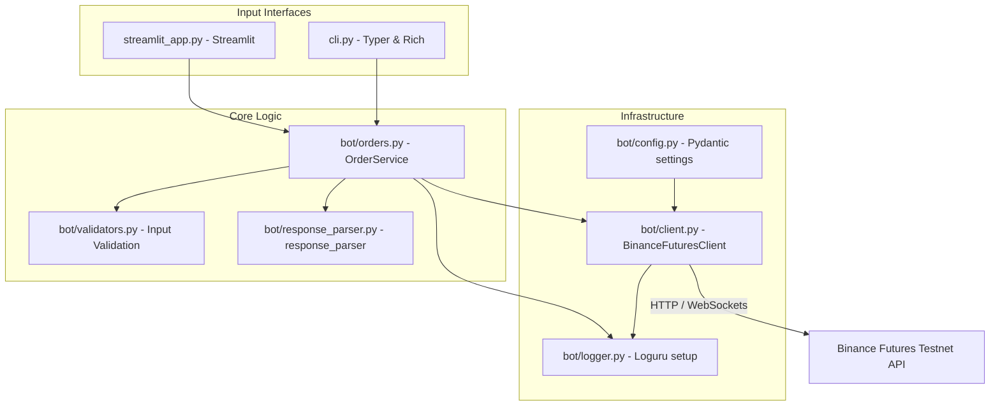

# PrimeTrade Trading Bot (Binance Futures Testnet)

PrimeTrade is a modular, high-reliability Python trading application engineered to execute trades on the **Binance Futures Testnet (USDT-M)**. Designed with clean architecture principles, it offers developer-friendly CLI interfaces, real-time logging telemetry, a local dashboard companion, and high-performance validation checks.

---

## Architecture Overview

PrimeTrade separates concerns by dividing components into input interfaces, orchestration layers, pre-flight validators, client drivers, and data normalization adapters.



- **Validation Layer (`bot/validators.py`)**: Fails fast by checking symbols, sides, order types, prices, and quantities locally before any network calls, saving latency and unnecessary API hits.
- **Client Integration (`bot/client.py`)**: Wraps python-binance with exponential backoff retries using `tenacity` for temporary network dropouts, while shielding endpoints from business logic failures.
- **Response Parser (`bot/response_parser.py`)**: Maps API-specific camelCase string variables to standardized snake_case floats using Pydantic models.
- **Logger (`bot/logger.py`)**: Implements rotating logging (10 MB files, 7-day retention) storing request payloads, responses, latency, and full exception tracebacks.

---

## Folder Structure

```
/Users/apple/Desktop/PrimeTrade_pythonProject/
├── bot/
│   ├── __init__.py          # Bot package init exposing clean symbols
│   ├── config.py            # Environment-based Pydantic configuration settings
│   ├── client.py            # Binance Futures API Client wrapper
│   ├── orders.py            # Coordinates validation, client, and parsing
│   ├── validators.py        # Validates order constraints and symbols
│   ├── exceptions.py        # Custom exceptions for granular error classification
│   ├── logger.py            # Loguru setup with rotating files
│   ├── models.py            # Pydantic schemas for order inputs and outputs
│   ├── response_parser.py   # Maps API responses to models
│   └── helpers.py           # Precision rounding and timestamp formatters
├── logs/
│   └── trading.log          # Rotated local logs
├── examples/
│   ├── market_order.log     # Example logged execution of MARKET order
│   └── limit_order.log      # Example logged execution of LIMIT order
├── tests/
│   ├── test_validators.py   # Unit tests for parameter checking
│   └── test_parser.py       # Unit tests for raw API schema parsing
├── cli.py                   # Main CLI Entrypoint (Typer & Rich)
├── streamlit_app.py         # Companion UI Dashboard (Streamlit)
├── .env.example             # Configuration template
├── .gitignore               # Ignored files configuration
├── requirements.txt         # Package dependencies
├── LICENSE                  # MIT License
└── README.md                # This documentation
```

---

## Setup & Installation

### Prerequisites
- Python 3.12 or 3.13
- Git

### 1. Clone & Set Up Directory
```bash
cd /Users/apple/Desktop/PrimeTrade_pythonProject
```

### 2. Create Virtual Environment
```bash
python3 -m venv venv
source venv/bin/activate  # On Linux/macOS
# or venv\Scripts\activate on Windows
```

### 3. Install Dependencies
```bash
pip install -r requirements.txt
```

### 4. Create and Configure Environment File
Copy `.env.example` to a new `.env` file at the root:
```bash
cp .env.example .env
```
Open `.env` and fill in your API credentials:
```env
BINANCE_API_KEY=your_actual_testnet_api_key
BINANCE_SECRET_KEY=your_actual_testnet_secret_key
BINANCE_BASE_URL=https://testnet.binancefuture.com
BINANCE_USE_TESTNET=True
LOG_LEVEL=INFO
```

---

## Creating Binance Testnet Account & API Keys

To retrieve your test keys:
1. Navigate to the [Binance Futures Testnet Web Platform](https://testnet.binancefuture.com).
2. Register an account (or login using your GitHub/Google account).
3. Scroll down to the bottom of the page to find the **API Key** section.
4. Click **Generate API Key**.
5. Copy both the **API Key** and **Secret Key** immediately and paste them into your `.env` file.

---

## Run Commands

### 1. Run Interactive CLI
Execute with no arguments to launch the interactive terminal:
```bash
python cli.py
```

### 2. Run Direct CLI Arguments
Place orders instantly using command flags:

#### Place MARKET Order
```bash
python cli.py --symbol BTCUSDT --side BUY --type MARKET --quantity 0.01
```

#### Place LIMIT Order
```bash
python cli.py --symbol BTCUSDT --side SELL --type LIMIT --quantity 0.01 --price 102000
```

#### Place STOP_LIMIT Order
```bash
python cli.py --symbol BTCUSDT --side BUY --type STOP_LIMIT --quantity 0.01 --price 103000 --stop-price 102500
```

### 3. Launch Streamlit Companion Dashboard
Run the following command to view the responsive UI:
```bash
streamlit run streamlit_app.py
```

### 4. Run Automated Unit Tests
Verify all validation logic, parsing formulas, and edge cases:
```bash
pytest tests/ -v
```

---

## Example Outputs

### CLI Output: Successful MARKET Order
```
------------------------------------
ORDER REQUEST
------------------------------------
Symbol      BTCUSDT
Side        BUY
Type        MARKET
Quantity    0.01

Submitting...

------------------------------------
ORDER RESPONSE
------------------------------------
Order ID        982173456
Status          FILLED
Executed Qty    0.01
Average Price   108200.15

✔ Trade completed successfully.
```

### Log File Output (`logs/trading.log`)
```
2026-06-08 14:45:01.102 | INFO     | bot.orders:execute_order:23 - Pre-flight Order Setup | Symbol: BTCUSDT | Side: BUY | Type: MARKET | Qty: 0.01
2026-06-08 14:45:01.103 | INFO     | bot.orders:execute_order:35 - Validation Passed | Target: BTCUSDT | Side: BUY | Type: MARKET
2026-06-08 14:45:01.456 | INFO     | bot.logger:log_api_call:57 - API Call | Endpoint: futures_create_order | Payload: {'args': (), 'kwargs': {'symbol': 'BTCUSDT', 'side': 'BUY', 'quantity': 0.01, 'type': 'MARKET'}} | Response: {'orderId': 982173456, ...} | Latency: 352.41ms | Retries: 0
2026-06-08 14:45:01.458 | INFO     | bot.orders:execute_order:52 - Order Complete | ID: 982173456 | Status: FILLED | AvgPrice: 108200.15
```

---

## Known Limitations & Future Roadmap

- **Precision/Rounding Constraints**: Binance requires price and lot size formatting rules per asset. Currently, input quantities must respect asset-specific lot step-sizes.
  - *Roadmap*: Implement an exchange information cache to load step-size parameters (`priceFilter`, `lotSizeFilter`) dynamically and auto-round values.
- **WebSocket Streaming**: Streamlit uses polling for account details.
  - *Roadmap*: Add continuous websocket listener threads to push real-time order update messages directly to UI containers.
- **Multi-Asset Portfolio Metrics**: Dashboard currently supports displaying basic balances.
  - *Roadmap*: Incorporate dynamic equity curves and position sizing recommendation models based on trade history.

---

## License

This project is licensed under the MIT License - see the [LICENSE](LICENSE) file for details.
